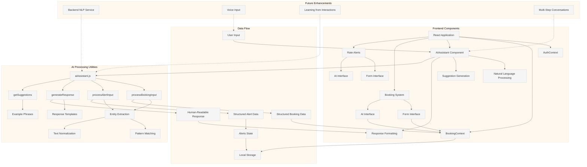

# Zahav AI Architecture Diagram

```mermaid
%%{
  init: {
    'theme': 'base',
    'themeVariables': {
      'primaryColor': '#f5f5f5',
      'primaryTextColor': '#333333',
      'primaryBorderColor': '#cccccc',
      'lineColor': '#666666',
      'secondaryColor': '#eef7ff',
      'tertiaryColor': '#fff8ee'
    }
  }
}%%
flowchart TB
    subgraph "Frontend Components"
        A[React Application] --> B[AuthContext]
        A --> C[BookingContext]
        A --> D[AIAssistant Component]
        A --> E[Booking System]
        A --> F[Rate Alerts]
        
        D --> D1[Natural Language Processing]
        D --> D2[Suggestion Generation]
        D --> D3[Response Formatting]
        
        E --> E1[Form Interface]
        E --> E2[AI Interface]
        E1 & E2 --> C
        
        F --> F1[Form Interface]
        F --> F2[AI Interface]
    end
    
    subgraph "AI Processing Utilities"
        G[aiAssistant.js] --> G1[processBookingInput]
        G --> G2[processAlertInput]
        G --> G3[generateResponse]
        G --> G4[getSuggestions]
        
        G1 --> H[Entity Extraction]
        G2 --> H
        H --> I[Pattern Matching]
        H --> J[Text Normalization]
        
        G3 --> K[Response Templates]
        G4 --> L[Example Phrases]
    end
    
    subgraph "Data Flow"
        M[User Input] --> D
        D --> G
        G1 --> N[Structured Booking Data]
        G2 --> O[Structured Alert Data]
        N --> C
        O --> P[Alerts State]
        
        C --> Q[Local Storage]
        P --> Q
        
        G3 --> R[Human-Readable Response]
        R --> D3
    end
    
    subgraph "Future Enhancements"
        S[Backend NLP Service] -.-> G
        T[Voice Input] -.-> M
        U[Learning from Interactions] -.-> G
        V[Multi-Step Conversations] -.-> D
    end
```
