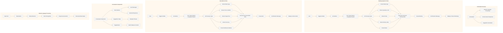

# Zahav AI Features Flow Diagram

```mermaid
%%{
  init: {
    'theme': 'base',
    'themeVariables': {
      'primaryColor': '#f5f5f5',
      'primaryTextColor': '#333333',
      'primaryBorderColor': '#cccccc',
      'lineColor': '#666666',
      'secondaryColor': '#eef7ff',
      'tertiaryColor': '#fff8ee'
    }
  }
}%%
flowchart TD
    subgraph "AI Assistant Overview"
        A[AI Assistant] --> B[Natural Language Processing]
        A --> C[Context-Aware Responses]
        A --> D[Suggestion Generation]
    end

    subgraph "Booking System AI Flow"
        E[User] --> F[Toggle AI Mode]
        F --> G[AI Interface]
        G --> H[User Types Natural Language Request]
        H --> I[AI Processes Input]
        I --> J[Extract Metal Type]
        I --> K[Extract Quantity & Unit]
        I --> L[Extract Purity]
        I --> M[Extract Delivery Date]
        I --> N[Extract Notes]
        J & K & L & M & N --> O[Generate Structured Booking Data]
        O --> P[Create Booking]
        P --> Q[Confirmation Message]
        Q --> R[Display in Recent Bookings]
    end

    subgraph "Rate Alerts AI Flow"
        S[User] --> T[Toggle AI Mode]
        T --> U[AI Interface]
        U --> V[User Types Natural Language Request]
        V --> W[AI Processes Input]
        W --> X[Extract Metal Type]
        W --> Y[Extract Price Condition]
        W --> Z[Extract Target Price]
        W --> AA[Extract Currency]
        W --> AB[Extract Notification Method]
        X & Y & Z & AA & AB --> AC[Generate Structured Alert Data]
        AC --> AD[Create Alert]
        AD --> AE[Confirmation Message]
        AE --> AF[Display in Active Alerts]
    end

    subgraph "AI Assistant Components"
        AG[AI Assistant Component] --> AH[Chat Interface]
        AG --> AI[Suggestion Chips]
        AG --> AJ[Toggle Button]
        AH --> AK[User Messages]
        AH --> AL[Assistant Responses]
        AI --> AM[Example Phrases]
        AJ --> AN[Switch Between Form/AI]
    end

    subgraph "Natural Language Processing"
        AO[Input Text] --> AP[Tokenization]
        AP --> AQ[Entity Extraction]
        AQ --> AR[Intent Recognition]
        AR --> AS[Response Generation]
        AS --> AT[Structured Data Output]
    end
```
