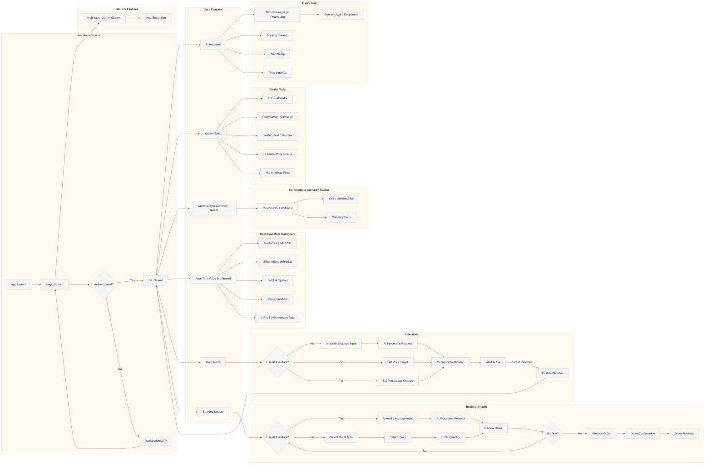

# Zahav Refinery App Flow Diagram

```mermaid
%%{
  init: {
    'theme': 'base',
    'themeVariables': {
      'primaryColor': '#f5f5f5',
      'primaryTextColor': '#333333',
      'primaryBorderColor': '#cccccc',
      'lineColor': '#666666',
      'secondaryColor': '#eef7ff',
      'tertiaryColor': '#fff8ee'
    }
  }
}%%
flowchart LR
    subgraph "User Authentication"
        A[App Launch] --> B[Login Screen]
        B --> C{Authenticated?}
        C -->|Yes| D[Dashboard]
        C -->|No| E[Registration/OTP]
        E --> B
    end

    subgraph "Core Features"
        D --> F[Real-Time Price Dashboard]
        D --> G[Booking System]
        D --> H[Rate Alerts]
        D --> I[Commodity & Currency Tracker]
        D --> J[Dealer Tools]
        D --> K[AI Assistant]
    end

    subgraph "Real-Time Price Dashboard"
        F --> F1[Gold Prices INR/USD]
        F --> F2[Silver Prices INR/USD]
        F --> F3[Bid/Ask Spread]
        F --> F4[Day's High/Low]
        F --> F5[INR/USD Conversion Rate]
    end

    subgraph "Booking System"
        G --> G0{Use AI Assistant?}
        G0 -->|No| G1[Select Metal Type]
        G0 -->|Yes| G9[Natural Language Input]
        G9 --> G10[AI Processes Request]
        G10 --> G4[Review Order]
        G1 --> G2[Select Purity]
        G2 --> G3[Enter Quantity]
        G3 --> G4
        G4 --> G5{Confirm?}
        G5 -->|Yes| G6[Process Order]
        G5 -->|No| G0
        G6 --> G7[Order Confirmation]
        G7 --> G8[Order Tracking]
    end

    subgraph "Rate Alerts"
        H --> H0{Use AI Assistant?}
        H0 -->|No| H1[Set Price Target]
        H0 -->|Yes| H6[Natural Language Input]
        H6 --> H7[AI Processes Request]
        H7 --> H3[Configure Notification]
        H0 -->|No| H2[Set Percentage Change]
        H1 --> H3
        H2 --> H3
        H3 --> H4[Alert Active]
        H4 -->|Target Reached| H5[Push Notification]
        H5 --> D
    end

    subgraph "Commodity & Currency Tracker"
        I --> I1[Customizable Watchlist]
        I1 --> I2[Other Commodities]
        I1 --> I3[Currency Pairs]
    end

    subgraph "Dealer Tools"
        J --> J1[TDS Calculator]
        J --> J2[Purity/Weight Converter]
        J --> J3[Landed Cost Calculator]
        J --> J4[Historical Price Charts]
        J --> J5[Market News Feed]
    end

    subgraph "Security Features"
        B --> S1[Multi-factor Authentication]
        S1 --> S2[Data Encryption]
    end

    subgraph "AI Assistant"
        K --> K1[Natural Language Processing]
        K --> K2[Booking Creation]
        K --> K3[Alert Setup]
        K --> K4[Price Inquiries]
        K1 --> K5[Context-Aware Responses]
    end
```
